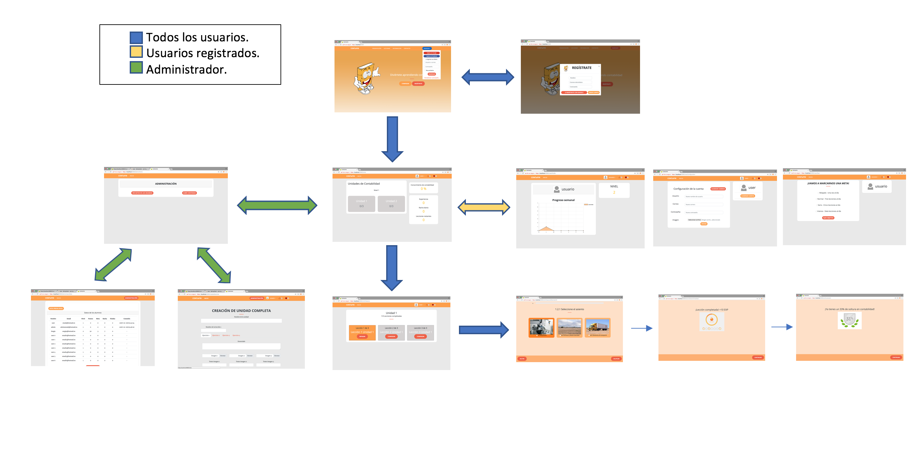
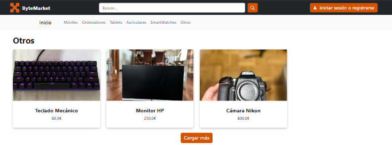

# [Nombre de la Aplicación]

## 👥 Miembros del Equipo
| Nombre y Apellidos | Correo URJC | Usuario GitHub |
|:--- |:--- |:--- |
| Mario Ortiz Lopo | m.ortizl.2023@alumnos.urjc.es | marioortiz-6 |
| Pablo Sánchez Martín | p.sanchezm.2023@alumnos.urjc.es | psmURJC |
| Javier Hérnandez Campano | j.hernandezca.2023@alumnos.urjc.es | javier0004 |
| [Nombre 4] | [email4]@alumnos.urjc.es | [User4] |

--- 

## 🎭 **Preparación: Definición del Proyecto**

### **Descripción del Tema**
Aplicación web para una *agencia* de viajes que ofrece paquetes turísticos organizados (tours) a distintos destinos, mostrando información de cada tour (precio por persona, duración, ubicación y características del alojamiento) y permitiendo a los usuarios buscar, filtrar y solicitar presupuestos online. Pertenece al sector turístico y facilita al usuario comparar destinos y tours de forma rápida, así como contactar con la agencia para gestionar su viaje. [themewagon.github](https://themewagon.github.io/pacific/destination.html)

### **Entidades**
Indicar las entidades principales que gestionará la aplicación y las relaciones entre ellas:

1. *Usuario*
2. *Destino*
3. *Tour* (Paquete turístico)
4. *Reserva / Solicitud de Presupuesto*
5. *Categoría de Experiencia* (Adventure, Beach, Nature, Camping, etc.) [themewagon.github](https://themewagon.github.io/pacific/destination.html)
6. *Alojamiento* (info resumida del hotel/apartamento asociado al tour)


**Relaciones entre entidades:**
- *Usuario - Reserva*: Un usuario puede crear múltiples reservas/solicitudes de presupuesto; cada reserva pertenece a un único usuario (1:N).
- *Tour - Reserva*: Una reserva está asociada a un único tour; un tour puede tener muchas reservas (1:N).
- *Destino - Tour*: Un destino (ej. “Banaue, Ifugao, Philippines”) puede tener múltiples tours; cada tour pertenece a un destino (1:N). [themewagon.github](https://themewagon.github.io/pacific/destination.html)
- *Tour - Categoría de Experiencia*: Un tour puede clasificarse en varias experiencias (Adventure, Beach, Nature, etc.) y cada experiencia agrupa múltiples tours (N:M). [themewagon.github](https://themewagon.github.io/pacific/destination.html)
- *Tour - Alojamiento*: Un tour está asociado a uno o varios alojamientos (por ejemplo, según tipo de habitación); un alojamiento puede pertenecer a distintos tours (N:M).
- *Usuario - Valoración (opcional)*: Un usuario puede dejar varias valoraciones sobre tours; cada valoración pertenece a un usuario y a un tour (1:N respecto a Usuario y 1:N respecto a Tour).

### **Permisos de los Usuarios**
Describir los permisos de cada tipo de usuario e indicar de qué entidades es dueño:

* *Usuario Anónimo*:  
  - Permisos:  
    - Visualizar listado de tours y destinos (catálogo público). [themewagon.github](https://themewagon.github.io/pacific/destination.html)
    - Buscar y filtrar tours por destino, fechas y rango de precio.  
    - Ver detalles básicos del tour (precio por persona, duración, ubicación, características).  
    - Enviar formulario de contacto genérico o “Ask For A Quote” sin cuenta (según diseño). [themewagon.github](https://themewagon.github.io/pacific/destination.html)
  - No es dueño de ninguna entidad.

* *Usuario Registrado*:  
  - Permisos:  
    - Todo lo del usuario anónimo.  
    - Gestionar su perfil (datos personales, preferencias de viaje).  
    - Crear y gestionar sus propias reservas/solicitudes de presupuesto de tours.  
    - Consultar el historial de reservas y estado (pendiente, confirmada, cancelada).  
    - Crear valoraciones/comentarios sobre tours (si se implementa módulo de opiniones).  
  - Es dueño de:  
    - Su Perfil de Usuario.  
    - Sus propias Reservas/Solicitudes de Presupuesto.  
    - Sus propias Valoraciones/Comentarios.

* *Administrador*:  
  - Permisos:  
    - Gestión completa (CRUD) de Tours (precio, duración, imágenes, descripción, servicios, etc.). [themewagon.github](https://themewagon.github.io/pacific/destination.html)
    - Gestión de Destinos (alta, baja, modificación de destinos y sus imágenes). [themewagon.github](https://themewagon.github.io/pacific/destination.html)
    - Gestión de Categorías de Experiencia (Adventure, Beach, Nature, etc.). [themewagon.github](https://themewagon.github.io/pacific/destination.html)
    - Gestión de Alojamientos asociados a los tours.  
    - Gestión de Usuarios (activar/desactivar cuentas, ver datos básicos y reservas).  
    - Gestión y revisión de Reservas/Solicitudes (cambio de estado, anulación, confirmación).  
    - Moderación de valoraciones/comentarios (aprobar, eliminar, marcar como inapropiados).  
    - Visualización de estadísticas generales (número de reservas por destino, tours más populares, ingresos estimados).  
  - Es dueño de:  
    - Tours, Destinos, Categorías y Alojamientos.  
    - Puede gestionar (no “poseer”) todas las Reservas y Usuarios.

---

## 🛠 **Práctica 1: Maquetación de páginas con HTML y CSS**

### **Vídeo de Demostración**
📹 **[Enlace al vídeo en YouTube](https://www.youtube.com/watch?v=x91MPoITQ3I)**
> Vídeo mostrando las principales funcionalidades de la aplicación web.

### **Diagrama de Navegación**
Diagrama que muestra cómo se navega entre las diferentes páginas de la aplicación:



> [Descripción opcional del flujo de navegación: Ej: "El usuario puede acceder desde la página principal a todas las secciones mediante el menú de navegación. Los usuarios anónimos solo tienen acceso a las páginas públicas, mientras que los registrados pueden acceder a su perfil y panel de usuario."]

### **Capturas de Pantalla y Descripción de Páginas**

#### **1. Página Principal / Home**


> [Descripción breve: Ej: "Página de inicio que muestra los productos destacados, categorías principales y un banner promocional. Incluye barra de navegación y acceso a registro/login para usuarios no autenticados."]

#### **AQUÍ AÑADIR EL RESTO DE PÁGINAS**

### **Participación de Miembros en la Práctica 1**

#### **Alumno 1 - [Nombre Completo]**

[Descripción de las tareas y responsabilidades principales del alumno en el proyecto]

| Nº    | Commits      | Files      |
|:------------: |:------------:| :------------:|
|1| [Descripción commit 1](URL_commit_1)  | [Archivo1](URL_archivo_1)   |
|2| [Descripción commit 2](URL_commit_2)  | [Archivo2](URL_archivo_2)   |
|3| [Descripción commit 3](URL_commit_3)  | [Archivo3](URL_archivo_3)   |
|4| [Descripción commit 4](URL_commit_4)  | [Archivo4](URL_archivo_4)   |
|5| [Descripción commit 5](URL_commit_5)  | [Archivo5](URL_archivo_5)   |

---

#### **Alumno 2 - [Nombre Completo]**

[Descripción de las tareas y responsabilidades principales del alumno en el proyecto]

| Nº    | Commits      | Files      |
|:------------: |:------------:| :------------:|
|1| [Descripción commit 1](URL_commit_1)  | [Archivo1](URL_archivo_1)   |
|2| [Descripción commit 2](URL_commit_2)  | [Archivo2](URL_archivo_2)   |
|3| [Descripción commit 3](URL_commit_3)  | [Archivo3](URL_archivo_3)   |
|4| [Descripción commit 4](URL_commit_4)  | [Archivo4](URL_archivo_4)   |
|5| [Descripción commit 5](URL_commit_5)  | [Archivo5](URL_archivo_5)   |

---

#### **Alumno 3 - [Nombre Completo]**

[Descripción de las tareas y responsabilidades principales del alumno en el proyecto]

| Nº    | Commits      | Files      |
|:------------: |:------------:| :------------:|
|1| [Descripción commit 1](URL_commit_1)  | [Archivo1](URL_archivo_1)   |
|2| [Descripción commit 2](URL_commit_2)  | [Archivo2](URL_archivo_2)   |
|3| [Descripción commit 3](URL_commit_3)  | [Archivo3](URL_archivo_3)   |
|4| [Descripción commit 4](URL_commit_4)  | [Archivo4](URL_archivo_4)   |
|5| [Descripción commit 5](URL_commit_5)  | [Archivo5](URL_archivo_5)   |

---

#### **Alumno 4 - [Nombre Completo]**

[Descripción de las tareas y responsabilidades principales del alumno en el proyecto]

| Nº    | Commits      | Files      |
|:------------: |:------------:| :------------:|
|1| [Descripción commit 1](URL_commit_1)  | [Archivo1](URL_archivo_1)   |
|2| [Descripción commit 2](URL_commit_2)  | [Archivo2](URL_archivo_2)   |
|3| [Descripción commit 3](URL_commit_3)  | [Archivo3](URL_archivo_3)   |
|4| [Descripción commit 4](URL_commit_4)  | [Archivo4](URL_archivo_4)   |
|5| [Descripción commit 5](URL_commit_5)  | [Archivo5](URL_archivo_5)   |

---

## 🛠 **Práctica 2: Web con HTML generado en servidor**

### **Vídeo de Demostración**
📹 **[Enlace al vídeo en YouTube](https://www.youtube.com/watch?v=x91MPoITQ3I)**
> Vídeo mostrando las principales funcionalidades de la aplicación web.

### **Navegación y Capturas de Pantalla**

#### **Diagrama de Navegación**

Solo si ha cambiado.

#### **Capturas de Pantalla Actualizadas**

Solo si han cambiado.

### **Instrucciones de Ejecución**

#### **Requisitos Previos**
- **Java**: versión 21 o superior
- **Maven**: versión 3.8 o superior
- **MySQL**: versión 8.0 o superior
- **Git**: para clonar el repositorio

#### **Pasos para ejecutar la aplicación**

1. **Clonar el repositorio**
   ```bash
   git clone https://github.com/[usuario]/[nombre-repositorio].git
   cd [nombre-repositorio]
   ```

2. **AQUÍ INDICAR LO SIGUIENTES PASOS**

#### **Credenciales de prueba**
- **Usuario Admin**: usuario: `admin`, contraseña: `admin`
- **Usuario Registrado**: usuario: `user`, contraseña: `user`

### **Diagrama de Entidades de Base de Datos**

Diagrama mostrando las entidades, sus campos y relaciones:


> [Descripción opcional: Ej: "El diagrama muestra las 4 entidades principales: Usuario, Producto, Pedido y Categoría, con sus respectivos atributos y relaciones 1:N y N:M."]

### **Diagrama de Clases y Templates**

Diagrama de clases de la aplicación con diferenciación por colores o secciones:


> [Descripción opcional del diagrama y relaciones principales]

### **Participación de Miembros en la Práctica 2**

#### **Alumno 1 - [Nombre Completo]**

[Descripción de las tareas y responsabilidades principales del alumno en el proyecto]

| Nº    | Commits      | Files      |
|:------------: |:------------:| :------------:|
|1| [Descripción commit 1](URL_commit_1)  | [Archivo1](URL_archivo_1)   |
|2| [Descripción commit 2](URL_commit_2)  | [Archivo2](URL_archivo_2)   |
|3| [Descripción commit 3](URL_commit_3)  | [Archivo3](URL_archivo_3)   |
|4| [Descripción commit 4](URL_commit_4)  | [Archivo4](URL_archivo_4)   |
|5| [Descripción commit 5](URL_commit_5)  | [Archivo5](URL_archivo_5)   |

---

#### **Alumno 2 - [Nombre Completo]**

[Descripción de las tareas y responsabilidades principales del alumno en el proyecto]

| Nº    | Commits      | Files      |
|:------------: |:------------:| :------------:|
|1| [Descripción commit 1](URL_commit_1)  | [Archivo1](URL_archivo_1)   |
|2| [Descripción commit 2](URL_commit_2)  | [Archivo2](URL_archivo_2)   |
|3| [Descripción commit 3](URL_commit_3)  | [Archivo3](URL_archivo_3)   |
|4| [Descripción commit 4](URL_commit_4)  | [Archivo4](URL_archivo_4)   |
|5| [Descripción commit 5](URL_commit_5)  | [Archivo5](URL_archivo_5)   |

---

#### **Alumno 3 - [Nombre Completo]**

[Descripción de las tareas y responsabilidades principales del alumno en el proyecto]

| Nº    | Commits      | Files      |
|:------------: |:------------:| :------------:|
|1| [Descripción commit 1](URL_commit_1)  | [Archivo1](URL_archivo_1)   |
|2| [Descripción commit 2](URL_commit_2)  | [Archivo2](URL_archivo_2)   |
|3| [Descripción commit 3](URL_commit_3)  | [Archivo3](URL_archivo_3)   |
|4| [Descripción commit 4](URL_commit_4)  | [Archivo4](URL_archivo_4)   |
|5| [Descripción commit 5](URL_commit_5)  | [Archivo5](URL_archivo_5)   |

---

#### **Alumno 4 - [Nombre Completo]**

[Descripción de las tareas y responsabilidades principales del alumno en el proyecto]

| Nº    | Commits      | Files      |
|:------------: |:------------:| :------------:|
|1| [Descripción commit 1](URL_commit_1)  | [Archivo1](URL_archivo_1)   |
|2| [Descripción commit 2](URL_commit_2)  | [Archivo2](URL_archivo_2)   |
|3| [Descripción commit 3](URL_commit_3)  | [Archivo3](URL_archivo_3)   |
|4| [Descripción commit 4](URL_commit_4)  | [Archivo4](URL_archivo_4)   |
|5| [Descripción commit 5](URL_commit_5)  | [Archivo5](URL_archivo_5)   |

---

## 🛠 **Práctica 3: Incorporación de una API REST a la aplicación web, análisis de vulnerabilidades y contramedidas**

### **Vídeo de Demostración**
📹 **[Enlace al vídeo en YouTube](https://www.youtube.com/watch?v=x91MPoITQ3I)**
> Vídeo mostrando las principales funcionalidades de la aplicación web.

### **Documentación de la API REST**

#### **Especificación OpenAPI**
📄 **[Especificación OpenAPI (YAML)](/api-docs/api-docs.yaml)**

#### **Documentación HTML**
📖 **[Documentación API REST (HTML)](https://raw.githack.com/[usuario]/[repositorio]/main/api-docs/api-docs.html)**

> La documentación de la API REST se encuentra en la carpeta `/api-docs` del repositorio. Se ha generado automáticamente con SpringDoc a partir de las anotaciones en el código Java.

### **Diagrama de Clases y Templates Actualizado**

Diagrama actualizado incluyendo los @RestController y su relación con los @Service compartidos:


#### **Credenciales de Usuarios de Ejemplo**

| Rol | Usuario | Contraseña |
|:---|:---|:---|
| Administrador | admin | admin123 |
| Usuario Registrado | user1 | user123 |
| Usuario Registrado | user2 | user123 |

### **Participación de Miembros en la Práctica 3**

#### **Alumno 1 - [Nombre Completo]**

[Descripción de las tareas y responsabilidades principales del alumno en el proyecto]

| Nº    | Commits      | Files      |
|:------------: |:------------:| :------------:|
|1| [Descripción commit 1](URL_commit_1)  | [Archivo1](URL_archivo_1)   |
|2| [Descripción commit 2](URL_commit_2)  | [Archivo2](URL_archivo_2)   |
|3| [Descripción commit 3](URL_commit_3)  | [Archivo3](URL_archivo_3)   |
|4| [Descripción commit 4](URL_commit_4)  | [Archivo4](URL_archivo_4)   |
|5| [Descripción commit 5](URL_commit_5)  | [Archivo5](URL_archivo_5)   |

---

#### **Alumno 2 - [Nombre Completo]**

[Descripción de las tareas y responsabilidades principales del alumno en el proyecto]

| Nº    | Commits      | Files      |
|:------------: |:------------:| :------------:|
|1| [Descripción commit 1](URL_commit_1)  | [Archivo1](URL_archivo_1)   |
|2| [Descripción commit 2](URL_commit_2)  | [Archivo2](URL_archivo_2)   |
|3| [Descripción commit 3](URL_commit_3)  | [Archivo3](URL_archivo_3)   |
|4| [Descripción commit 4](URL_commit_4)  | [Archivo4](URL_archivo_4)   |
|5| [Descripción commit 5](URL_commit_5)  | [Archivo5](URL_archivo_5)   |

---

#### **Alumno 3 - [Nombre Completo]**

[Descripción de las tareas y responsabilidades principales del alumno en el proyecto]

| Nº    | Commits      | Files      |
|:------------: |:------------:| :------------:|
|1| [Descripción commit 1](URL_commit_1)  | [Archivo1](URL_archivo_1)   |
|2| [Descripción commit 2](URL_commit_2)  | [Archivo2](URL_archivo_2)   |
|3| [Descripción commit 3](URL_commit_3)  | [Archivo3](URL_archivo_3)   |
|4| [Descripción commit 4](URL_commit_4)  | [Archivo4](URL_archivo_4)   |
|5| [Descripción commit 5](URL_commit_5)  | [Archivo5](URL_archivo_5)   |

---

#### **Alumno 4 - [Nombre Completo]**

[Descripción de las tareas y responsabilidades principales del alumno en el proyecto]

| Nº    | Commits      | Files      |
|:------------: |:------------:| :------------:|
|1| [Descripción commit 1](URL_commit_1)  | [Archivo1](URL_archivo_1)   |
|2| [Descripción commit 2](URL_commit_2)  | [Archivo2](URL_archivo_2)   |
|3| [Descripción commit 3](URL_commit_3)  | [Archivo3](URL_archivo_3)   |
|4| [Descripción commit 4](URL_commit_4)  | [Archivo4](URL_archivo_4)   |
|5| [Descripción commit 5](URL_commit_5)  | [Archivo5](URL_archivo_5)   |
